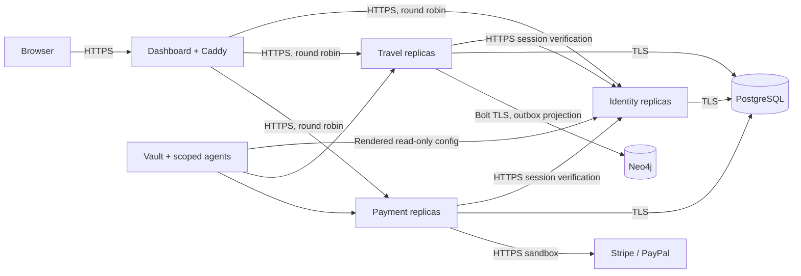

# Travel Plan

A Java microservices project with a working travel administration dashboard. Built for the first phase of the Travel-Plan assignment: environment, user management, itineraries, payment-method administration, security, and delivery tooling.

**Current laptop status:** implementation and earlier live checks are saved, but Docker is stopped after the C: drive filled up. Recover disk space before starting. See [verification status](docs/VERIFICATION.md) for completed checks and remaining work.

The interface uses Scroll Craft's live-surface principles: purposeful navigation, restrained motion, a consistent type and spacing system, and a destination ribbon that reveals the activities, stay, and transport for each stop.

## Start on this Windows laptop

Prerequisites: Docker Desktop running Linux containers, Python 3.10+, and JDK 17+ with `keytool`. Allow roughly 3 GB for the laptop application profile. Running Jenkins and SonarQube at the same time needs substantially more memory.

```powershell
cd "$env:USERPROFILE\Desktop\travel-plan"
python -m pip install -r scripts/requirements.txt
.\scripts\start.ps1
```

Open **https://localhost:8443**. The initial account is `admin@travelplan.local`; its randomly generated password is in `.secrets/admin-login.txt`. The development CA is not installed into your operating system automatically. See [local TLS](docs/OPERATIONS.md#local-tls) before accepting a certificate warning.

`start.ps1` uses `compose.local.yml`, with one instance of each Java service. The standard `compose.yml` declares **two replicas of every Java microservice**:

```powershell
python scripts/bootstrap.py
docker compose up -d --build --wait --wait-timeout 240
```

Bootstrap generates per-service TLS certificates, isolated database credentials, an administrator password, scoped Vault AppRoles, and a persistent Raft-backed development Vault. Existing database and secret values are preserved. It seeds four explicitly labelled sample journeys and two disabled sandbox payment providers.

## Working features

- **Overview:** counts calculated from saved records, next departure, destination imagery, and itinerary previews.
- **Travel plans:** create, search, filter, edit, export CSV, and delete. Multiple destinations with activities, accommodation, transport, dates, computed duration, price, capacity, and participant assignments. Optimistic locking prevents silent lost updates.
- **People:** create, edit, suspend, change roles, reset passwords, and delete. An admin cannot remove their own access or remove the final active admin.
- **Payments:** Stripe/PayPal gateway CRUD, currency, enablement, sandbox credential status, and provider credential verification. No card data is handled by this application.
- **Calendar:** month navigation, day selection, and real itinerary dates.
- **Authentication:** eight-hour revocable server sessions, secure HttpOnly cookies, BCrypt passwords, CSRF checks, login throttling, role-based permissions, and immediate user suspension/deletion enforcement.
- **Responsive UI:** keyboard-accessible native dialogs, reduced motion support, mobile navigation, accessible labels and focus states.

Payment capture, refunds, booking checkout, and signed provider webhooks belong to the next phase. This project administers and verifies payment gateways; it does not pretend to collect money. Supply your own sandbox credentials to run the external provider checks.

## Architecture



The three services have separate database schemas and runtime roles. PostgreSQL is the source of truth; an idempotent, retryable outbox projects destination relationships into Neo4j. Cross-schema foreign keys intentionally provide atomic cascading behavior for this teaching project. The tradeoff and a future separation path are documented in [architecture](docs/ARCHITECTURE.md).

This is a **single-host development deployment**, not a claim of production high availability. The gateway, PostgreSQL, Neo4j Community instance, and local Vault node are single points of failure. Production requires redundant ingress, PostgreSQL failover/backups, an appropriate Neo4j cluster offering, and a multi-node Vault deployment.

## Verification

```powershell
# Included Maven wrapper (requires JDK 17+):
.\mvnw.cmd -B verify
cd dashboard
npm ci
npm run build
npm test
npm run test:e2e
```

The end-to-end suite runs real authenticated CRUD against the local services. It checks navigation, itinerary persistence, stale updates, role restrictions, CSRF, cascading deletion, session revocation, phone overflow, reduced motion, and WCAG accessibility rules. Browser tests do not make real payments. They create and clean up their own records.

Use `scripts/verify-infrastructure.py` for verified internal TLS, PostgreSQL transport enforcement, and graph projection checks. [VERIFICATION.md](docs/VERIFICATION.md) records the latest observed results and limitations.

## Delivery and operations

- [Architecture and consistency](docs/ARCHITECTURE.md)
- [Database schema and cascading rules](docs/SCHEMA.md)
- [API reference](docs/API.md)
- [Local operations, Vault, backups, TLS, and provider setup](docs/OPERATIONS.md)
- [Jenkins, SonarQube, PR review, Ansible, and deployment](docs/DELIVERY.md)
- [Security decisions and production work](docs/SECURITY.md)
- [Package choices and asset credits](docs/DECISIONS.md)

The optional tool stack is in `compose.tools.yml`. It includes Jenkins with authentication, SonarQube with PostgreSQL and a TLS proxy, and a TLS-protected Loki/Grafana monitoring stack. These profiles are deliberately not started by the laptop launcher.

The complete Scroll Craft skill is installed in `.agents/skills/scroll-craft/`. Its local design brief and fingerprint are in `scrollcraft/`.
