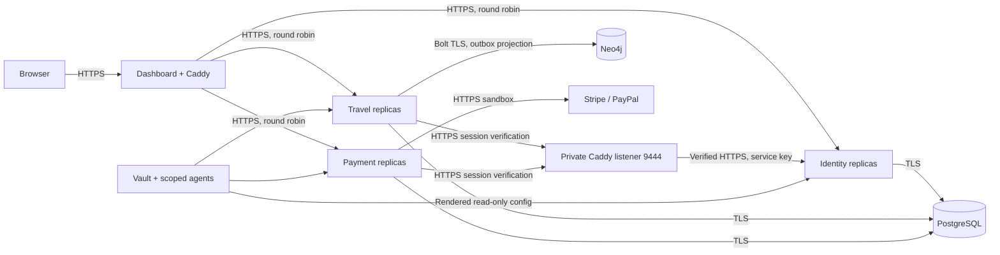

# Travel Plan

Development and PR checks now run in the [GitHub working repository](https://github.com/hujaafar/travel-plan). The [course Gitea repository](https://learn.reboot01.com/git/hujaafar/travel-plan) is the final delivery destination. See [GitHub workflow and sync policy](docs/GITHUB-WORKFLOW.md).

A Java microservices project with a working travel administration dashboard. Built for the first phase of the Travel-Plan assignment: environment, user management, itineraries, payment-method administration, security, and delivery tooling.

**Requirement audit (19 September):** The merged `main` revision passed [Jenkins/Sonar and live deployment checks](https://github.com/hujaafar/travel-plan/actions/runs/35206087570). The new [requirement-by-requirement audit](docs/REQUIREMENTS-AUDIT.md) identifies an Admin-only access mismatch and missing concurrent-load/redeployment evidence, addressed in [PR #2](https://github.com/hujaafar/travel-plan/pull/2). Whole-system HA, strict database independence, Neo4j runtime least privilege, owner payment sandbox checks and independent review remain incomplete. Earlier September 17 reports are historical measurements, not certification of every current requirement.

Unified Atlas carries the requested Scroll Craft design through one consistent product: an Earth-to-destination opening, expanding departure photograph, drawn route, independent ticket, itinerary spread, dimensional gallery and orbital close, followed by administration pages using the same ink, ivory and copper palette. Shared headings, buttons, tables, forms, calendar, settings, help and login follow the same visual system. Native scrolling controls the scenes; mobile uses a swipeable gallery. Motion is always enabled at the user's explicit request, including when an old off choice is stored or the OS requests reduced motion. Direct chapters and skip controls remain available.

## Open the design without Docker

The supplied `Travel-Plan-Preview.html` can be opened directly in Chrome or Firefox. It contains the complete built interface, fonts and photographs, plus fictional sample data. Its sample scope is explained in login, help and the handoff; the topbar preview badge was removed at the user's request. Forms save only in that browser's local storage. It makes no external requests, does not authenticate real users and cannot contact payment providers.

To regenerate and verify the preview from source:

```powershell
cd dashboard
npm ci
npm run build
python ../scripts/export-preview.py
node scripts/verify-design.mjs
node scripts/verify-orbit.mjs
node scripts/verify-consistency.mjs
# Requires Playwright's Firefox and its operating-system dependencies:
$env:DESIGN_BROWSER = 'firefox'
node scripts/verify-design.mjs
node scripts/verify-orbit.mjs
node scripts/verify-consistency.mjs
```

Preview results are separate from the real-service end-to-end suite below. The design and orbit scripts cover scroll layers, SVG routes, pointer depth, itinerary selection, gallery movement, keyboard focus, mobile swiping, the always-on motion policy, local travel CRUD, empty/single-plan layouts, persistence and CSV export. The consistency suite adds desktop/mobile coverage of all pages, lower Home sections, editors, details, help and sign-in, with paired contact sheets and recorded palette values. Run `node scripts/record-design.mjs` after the tests to record the scroll sequence. See the verification record for which checks have completed on the current revision.

## Start on this Windows laptop

Prerequisites: Docker Desktop running Linux containers, Python 3.10+, and JDK 17+ with `keytool`. Allocate at least 4 GB to Docker with 2 GB of swap for the laptop profile; fresh Vault processes need additional startup headroom. Run Jenkins/Sonar separately on a constrained laptop, or use the isolated GitHub workflow.

```powershell
cd "$env:USERPROFILE\Desktop\travel-plan"
python -m pip install -r scripts/requirements.txt
.\scripts\start.ps1
```

Open **https://localhost:8443**. The initial account is `admin@travelplan.local`; its randomly generated password is in `.secrets/admin-login.txt`. The development CA is not installed into your operating system automatically. See [local TLS](docs/OPERATIONS.md#local-tls) before accepting a certificate warning.

`start.ps1` uses `compose.local.yml`, with one instance of each Java service. The standard `compose.yml` declares **two replicas of every Java microservice**:

```powershell
python scripts/bootstrap.py
docker compose up -d --build --wait --wait-timeout 240
```

Bootstrap generates per-service TLS certificates, isolated database credentials, an administrator password, scoped Vault AppRoles, and a persistent Raft-backed development Vault. Existing database and secret values are preserved. It seeds four explicitly labelled sample journeys and two disabled sandbox payment providers.

## Working features

- **Overview:** counts calculated from saved records, next departure, destination imagery, and itinerary previews.
- **Travel plans:** create, search, filter, edit, export CSV, and delete. Multiple destinations with activities, accommodation, transport, dates, computed duration, price, capacity, and participant assignments. Optimistic locking prevents silent lost updates.
- **People:** create, edit, suspend, change roles, reset passwords, and delete. An admin cannot remove their own access or remove the final active admin.
- **Payments:** Stripe/PayPal gateway CRUD, currency, enablement, sandbox credential status, and provider credential verification. No card data is handled by this application.
- **Calendar:** month navigation, day selection, and real itinerary dates.
- **Authentication:** eight-hour revocable server sessions, secure HttpOnly cookies, BCrypt passwords, CSRF checks, login throttling, role-based permissions, and immediate user suspension/deletion enforcement.
- **Responsive UI:** keyboard-accessible native dialogs, mobile navigation, shared page and form treatments, accessible labels and focus states, and direct controls for the always-enabled scroll scenes.

Payment capture, refunds, booking checkout, and signed provider webhooks belong to the next phase. This project administers and verifies payment gateways; it does not pretend to collect money. Supply your own sandbox credentials to run the external provider checks.

## Architecture



The three services have separate database schemas and runtime roles. PostgreSQL is the source of truth; an idempotent, retryable outbox projects destination relationships into Neo4j. Cross-schema foreign keys intentionally provide atomic cascading behavior for this teaching project. The tradeoff and a future separation path are documented in [architecture](docs/ARCHITECTURE.md).

This is a **single-host development deployment**, not a claim of production high availability. The gateway, PostgreSQL, Neo4j Community instance, and local Vault node are single points of failure. Production requires redundant ingress, PostgreSQL failover/backups, an appropriate Neo4j cluster offering, and a multi-node Vault deployment.

## Verification

```powershell
# Included Maven wrapper (requires JDK 17+):
.\mvnw.cmd -B verify
cd dashboard
npm ci
npm run build
npm test
npm run test:e2e
```

The end-to-end suite runs real authenticated CRUD against the local services. It checks navigation, itinerary persistence, stale updates, role restrictions, CSRF, cascading deletion, session revocation, phone overflow and WCAG accessibility rules. The current live run passed seven Chrome scenarios and five Firefox workspace scenarios; the two direct database-fixture cases ran through Chrome on Windows. Browser tests do not make real payments. They create and clean up their own records.

Use `scripts/verify-infrastructure.py` for verified internal TLS, PostgreSQL transport enforcement, and graph projection checks. [VERIFICATION.md](docs/VERIFICATION.md) records the latest observed results and limitations.

See the [feature test map](docs/TEST-MATRIX.md) and [reproducible infrastructure gates](docs/INFRASTRUCTURE-GATES.md). Run `python scripts/pre-submit.py` after installing the declared dependencies to collect local checks and explicitly unverified external gates.

## Delivery and operations

- [Architecture and consistency](docs/ARCHITECTURE.md)
- [Database schema and cascading rules](docs/SCHEMA.md)
- [API reference](docs/API.md)
- [Local operations, Vault, backups, TLS, and provider setup](docs/OPERATIONS.md)
- [Jenkins, SonarQube, PR review, Ansible, and deployment](docs/DELIVERY.md)
- [Security decisions and production work](docs/SECURITY.md)
- [Package choices and asset credits](docs/DECISIONS.md)

The optional tool stack is in `compose.tools.yml`. It includes Jenkins with authentication, SonarQube with PostgreSQL and a TLS proxy, and a TLS-protected Loki/Grafana monitoring stack. These profiles are deliberately not started by the laptop launcher.

The complete Scroll Craft skill is installed in `.agents/skills/scroll-craft/`. Its local design brief and fingerprint are in `scrollcraft/`.
