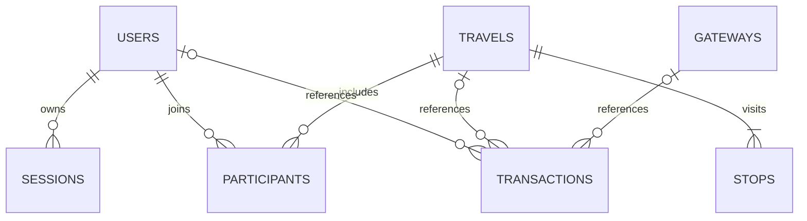

# Database schema

| Table | Important columns and constraints |
|---|---|
| `identity.users` | UUID PK, unique normalized email, name, BCrypt hash, role enum, status enum, creation timestamp |
| `identity.sessions` | SHA-256 token hash PK, user FK, CSRF token, expiry |
| `identity.login_attempts` | normalized email PK, failure counter, lock deadline |
| `travel.travels` | UUID PK, dates with end >= start, nonnegative decimal price, positive capacity, status, asset key, version |
| `travel.stops` | composite PK `(travel_id, position)`, destination, country, activities, accommodation, transport |
| `travel.participants` | composite PK `(travel_id, user_id)`; membership is unique |
| `travel.graph_outbox` | sequence ID, stable travel UUID, timestamp; deliberately no FK so a deletion can be projected |
| `payments.gateways` | UUID PK, name, Stripe/PayPal provider, currency, enabled state |
| `payments.transactions` | reserved phase-two ledger shape: nullable references, unique provider reference, amount, currency, status |

## Cascades

- Delete user: remove sessions and travel memberships automatically. Keep transaction history with a null user reference.
- Delete travel: remove its stops and memberships automatically; enqueue a graph deletion. Keep transaction history with a null travel reference.
- Delete payment method: keep transaction history with a null gateway reference.
- Edit travel: replace children and memberships transactionally and increment the optimistic version.
- IDs are immutable; editing names, emails, or destinations does not rewrite entity IDs. There is no arbitrary primary-key update API.

The transaction table is a forward-compatible schema only, not a claim of implemented checkout or payment collection.

## Neo4j model

`(:Travel {id, title})-[:VISITS {position}]->(:Destination {name, country})`

Country is part of the destination identity, so equally named places in different countries are distinct. An ordered itinerary can be reconstructed by ordering `VISITS.position`.

## Initialization and changes

`infra/postgres/000-roles.sql` is generated privately as `.secrets/000-roles.sql`. The checked-in `001-schema.sql` and `002-sample.sql` run only for a new PostgreSQL volume. `003-runtime-privileges.sql` is idempotent and is applied by bootstrap to restrict service roles. Do not delete the volume to apply future migrations. Add reviewed forward migrations and a migration journal as the schema evolves.
